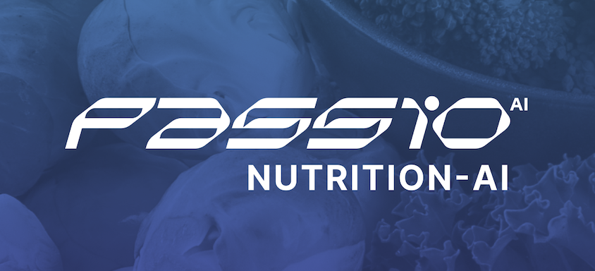

# React Native Passio Nutrition-AI UI/UX SDK



[](https://github.com/passiolife/nutrition-ai-ui-ux/blob/main/LICENSE)
[](https://www.npmjs.com/package/@passiolife/nutrition-ai-ui-ux)
[](https://passio.ai/)

## Overview

This repository provides a ready-to-integrate module that adds AI-driven food tracking to your app. It adds the following features:

1. **Daily Nutrition Tracking**

   Users are able to add daily nutrition logs via multiple methods:
   - Photo logging (via gallery or live camera)
   - Barcode scanning (scanning barcodes from products and adjusting serving sizes as needed)
   - Voice logging (record meal or a full day of food intake via voice and edit the log before confirming)
   - Text search (search for food items by name and adjust serving sizes as needed)
   - Photo logging from Nutrition Facts Label (supports foods where barcode is not available and allows users to log food items from the product labels)


2. **AI Advisor**

   The AI Advisor feature provides users with a nutrition assistant that can answer nutrition-related questions, generate recipes, and provide dietary advice tailored to their needs. Users can also send images of food items to the AI Advisor, which will identify the foods and provide recipe ideas or ingredient information. Additionally, users can seamlessly log foods directly from their conversation with the AI Advisor by providing meal information.

  
3. **Water Intake and Weight Tracking**

   The Water Intake feature enables users to monitor their hydration by recording consumption details including quantity, date, and time. Users can also track their weight via manual input. 

4. **Meal Plans**

   The Meal Plans feature provides users with comprehensive 15-day meal plans tailored to specific dietary needs and health goals. We offer a number of fixed meal plan including Heart Healthy Diet, Ketogenic Diet, Managing Obesity, and many more. We also recently launched a dedicated Meal Plan API (not yet available in the module, but available with your Nutrition-AI Hub subscription via a REST API).

5. **Progress Report**
     
   The Progress Report provides insights into nutritional intake over time. Users can view detailed reports of macronutrients and micronutrients with customizable date selection. The intuitive visualization helps track dietary habits and identify trends.

6. **Nutrition Goals**

    Nutrition Goals calculates BMI and sets personalized macronutrient targets based on activity level, calorie deficit, and dietary preferences. Users can customize daily targets for calories, protein, fat, and carbs. The Dashboard shows goals vs. actual consumption for easy tracking.

#### After you're done with the integration, you should have a fully functional AI-Powered Nutrition Tracker in your app.

### Who is this for?

This module is targeting developers and teams with existing apps who want to add robust nutrition tracking functionality and are comfortable with Passio's current template designs. The module speeds up your integration and deployment, but to some extent limits customizability and makes a number of key design and data structuring decisions for you.

### Should I use this module or Passio SDK?

This module incorporates Passio SDK, adds UI/UX elements, designs and data management layer. It is designed to speed up your integration process while still allowing you to customize the theme and look of the nutrition tracker in your app. You will be able to customize a number of things, including colors, icon colors, branding, and other visual elements to match your app's identity.

However, there are limitations on customizability. Here are some things you will not be able to do:
- Not able to move components (e.g., search form) to a different location
- Not able to remove elements from screens
- Not able to remove features from the module

If full customizability is important for app, you should use Passio SDK instead of the module.

## Installation

#### Step 1: Create an .npmrc or yarnrc.yml file in the root of your project with the following lines replacing GITHUB_ACCESS_TOKEN with the token you've created

`.npmrc`

```sh
//npm.pkg.github.com/:_authToken=GITHUB_ACCESS_TOKEN
@passiolife:registry=https://npm.pkg.github.com
```

or
`yarnrc.yml`

```sh
npmScopes:
  passiolife:
    npmRegistryServer: 'https://npm.pkg.github.com'
    npmAuthToken: 'GITHUB_ACCESS_TOKEN'
```

#### Step 2: Open terminal

```sh
yarn add @passiolife/nutrition-ai-ui-ux

yarn add @passiolife/nutritionai-react-native-sdk-v3
```

#### Step 3: add react-native.config.js at root

```shmodule.exports = {
    project: {
      ios: {},
      android: {},
    },
    dependencies: {
      'react-native-linear-gradient': {},
      '@react-native-async-storage/async-storage': {},
      '@react-native-community/datetimepicker': {},
      'react-native-fs': {},
      '@notifee/react-native': {},
      'react-native-svg': {},
      '@passiolife/nutritionai-react-native-sdk-v3': {},
      'react-native-vision-camera': {},
      'react-native-image-picker': {},
      '@react-native-community/slider': {},
      'lottie-react-native': {},
      '@react-native-voice/voice': {},
    },
  };
```

#### Step 4: For Android, add this implementation line to the dependencies section on app/build.gradle file

```sh
dependencies {
    // Add this line below for Passio SDK library
    implementation files("$rootDir/../node_modules/@passiolife/nutritionai-react-native-sdk-v3/android/libs/passiolib-release.aar")
    ...
}

```

#### Make sure this dependencies are added into your project

```
yarn add @react-navigation/native
yarn add @react-navigation/native-stack
yarn add @react-navigation/stack
yarn add react-native-gesture-handler
yarn add react-native-reanimated
yarn add react-native-safe-area-context
yarn add react-native-screens
yarn add react-native-sqlite-storage

```

### Add Reanimated's babel plugin

Add react-native-reanimated/plugin plugin to your babel.config.js.

```js
module.exports = {
    presets: [
      ... // don't add it here :)
    ],
    plugins: [
      ...
      'react-native-reanimated/plugin',
    ],
  };
```

## Permission

#### IOS Permission

```
 Privacy - NSCameraUsageDescription
 Privacy - NSSpeechRecognitionUsageDescription
 Privacy - NSMicrophoneUsageDescription
 Privacy - Photo Library Usage Description
```

#### Android Permission

```
<uses-permission android:name="android.permission.CAMERA" />

```

### Required Dependencies

| Dependency                     | Required Version |
| ------------------------------ | ---------------- |
| react-native-reanimated        | >=^3.6.1         |
| react-native-gesture-handler   | >=2.16.0         |
| react-native-safe-area-context | >=4.8.2          |

⚠️ Issue

If you find a duplicate entry for '@react-navigation', ensure that the your project navigation dependencies are match our navigation dependencies require versions.

### Additional Navigation Dependencies

| Dependency                     | Required Version |
| ------------------------------ | ---------------- |
| @react-navigation/native       | >=^6.1.17        |
| @react-navigation/native-stack | >=6.1.17         |
| @react-navigation/stack        | >=6.3.29         |
| @react-navigation/bottom-tabs  | >=6.5.20         |
| react-native-screens           | >=3.30.1         |

# Usage example

### Note: Ensure your SDK is configured correctly before launching the Nutrition AI module

## Using Internal Services

```JS
import React from 'react';
import {
  BrandingProvider,
  NutritionNavigator,
  ServicesProvider,
  usePassioConfig
} from '@passiolife/nutrition-ai-ui-ux';
import { NavigationContainer } from '@react-navigation/native';

export default function App() {

 const { isReady } = usePassioConfig({ key: "YOUR_PASSIO_KEY" });

  if (!isReady) {
    return <Loading />;
  }

  return (
    <ServicesProvider>
      <BrandingProvider>
          <NutritionNavigator />
      </BrandingProvider>
    </ServicesProvider>
  );
}


```

## Using External Services

#### Step 1: If you'd like to include your data service, follow the steps below. Otherwise, skip to the next step

`NutritionDataService` used for Return a function to store or retrieve data through a REST API, local database, or Firebase, etc

```js

export const dataService: NutritionDataService = {
  /**
   * Retrieves the patient profile.
   * @returns A `Promise` resolving to the patient profile.
   */
  getPatientProfile: () => getPatientProfile(),

  /**
   * Saves a food log.
   * @param foodLog - The food log to save.
   * @returns A `Promise` that resolves when the operation is complete.
   */
  async saveFoodLog(foodLog: FoodLog): Promise<void> {
    return saveFoodLog(foodLog);
  },

  /**
   * Retrieves food logs.
   * @returns A `Promise` resolving to an array of food logs.
   */
  async getFoodLogs(): Promise<FoodLog[]> {
    return getFoodLogs();
  },

  /**
   * Deletes a food log.
   * @param uuid - The UUID of the food log to delete.
   * @returns A `Promise` that resolves when the operation is complete.
   */
  async deleteFoodLog(uuid: string): Promise<void> {
    return deleteFoodLog(uuid);
  },

  /**
   * Deletes a recipe.
   * @param uuid - The UUID of the recipe to delete.
   * @returns A `Promise` that resolves when the operation is complete.
   */
  async deleteRecipe(uuid: string): Promise<void> {
    return deleteRecipe(uuid);
  },

  /**
   * Deletes a favorite food item.
   * @param uuid - The UUID of the favorite food item to delete.
   * @returns A `Promise` that resolves when the operation is complete.
   */
  async deleteFavoriteFoodItem(uuid: string): Promise<void> {
    return deleteFavoriteFoodItem(uuid);
  },

  /**
   * Retrieves meal logs within a specified date range.
   * @param startDate - The start date of the range.
   * @param endDate - The end date of the range.
   * @returns A `Promise` resolving to an array of meal logs.
   */
  async getMealLogs(startDate: Date, endDate: Date): Promise<FoodLog[]> {
    return getMealLogs(startDate, endDate);
  },

  /**
   * Saves a favorite food item.
   * @param favoriteFoodItem - The favorite food item to save.
   * @returns A `Promise` that resolves when the operation is complete.
   */
  async saveFavoriteFoodItem(favoriteFoodItem: FavoriteFoodItem): Promise<void> {
    return saveFavoriteFoodItem(favoriteFoodItem);
  },

  /**
   * Retrieves favorite food items.
   * @returns A `Promise` resolving to an array of favorite food items.
   */
  async getFavoriteFoodItems(): Promise<FavoriteFoodItem[]> {
    return getFavoriteFoodItems();
  },

  /**
   * Saves a nutrition profile.
   * @param nutritionProfile - The nutrition profile to save.
   * @returns A `Promise` that resolves when the operation is complete.
   */
  saveNutritionProfile(nutritionProfile: NutritionProfile): Promise<void> {
    return saveNutritionProfile(nutritionProfile);
  },

  /**
   * Saves a recipe.
   * @param recipe - The recipe to save.
   * @returns A `Promise` that resolves when the operation is complete.
   */
  async saveRecipe(recipe: Recipe): Promise<void> {
    return saveRecipe(recipe);
  },

  /**
   * Retrieves recipes.
   * @returns A `Promise` resolving to an array of recipes.
   */
  async getRecipes(): Promise<Recipe[]> {
    return getRecipes();
  },

  /**
   * Retrieves the nutrition profile.
   * @returns A `Promise` resolving to the nutrition profile, or `undefined` if not found.
   */
  async getNutritionProfile(): Promise<NutritionProfile | undefined> {
    return getNutritionProfile();
  },

  /**
   * Retrieves water logs within a specified date range.
   * @param startDate - The start date of the range.
   * @param endDate - The end date of the range.
   * @returns A `Promise` resolving to an array of water logs.
   */
  async getWaters(startDate: Date, endDate: Date): Promise<Water[]> {
    return getWaters(startDate, endDate);
  },

  /**
   * Deletes a water log.
   * @param uuid - The UUID of the water log to delete.
   * @returns A `Promise` that resolves when the operation is complete.
   */
  async deleteWater(uuid: string): Promise<void> {
    return deleteWater(uuid);
  },

  /**
   * Deletes a weight log.
   * @param uuid - The UUID of the weight log to delete.
   * @returns A `Promise` that resolves when the operation is complete.
   */
  async deleteWeight(uuid: string): Promise<void> {
    return deleteWeight(uuid);
  },

  /**
   * Retrieves weight logs within a specified date range.
   * @param startDate - The start date of the range.
   * @param endDate - The end date of the range.
   * @returns A `Promise` resolving to an array of weight logs.
   */
  async getWeight(startDate: Date, endDate: Date): Promise<Weight[]> {
    return getWeight(startDate, endDate);
  },
};
```

#### Step: 2 If you're want to apply your theme, you can use the following, although it's in experimental mode. otherwise you can skip to next step

Nutrition-UX SDK also provide Branding into BrandingProvider.

```js
  // you can change primary color form here
 export const branding: Branding = {
  primaryColor: 'rgba(79, 70, 229, 1)',
  backgroundColor: 'rgba(249, 250, 251, 1)',
  black: 'rgba(0, 0, 0, 1)',
  text: 'rgba(17, 24, 39, 1)',
  border: 'rgba(229, 231, 235, 1)',
  calories: 'rgba(245, 158, 11, 1)',
  carbs: 'rgba(14, 165, 233, 1)',
  error: 'rgba(239, 68, 68, 1)',
  fat: 'rgba(139, 92, 246, 1)',
  font: 'Passio-Regular',
  gray300: 'rgba(209, 213, 219, 1)',
  gray500: 'rgba(107, 114, 128, 1)',
  indigo50: 'rgba(238, 242, 255, 1)',
  proteins: 'rgba(16, 185, 129, 1)',
  purple: 'rgba(79, 70, 229, 1)',
  searchBody: 'rgba(242, 245, 251, 1)',
  secondaryText: 'rgba(107, 114, 128, 1)',
  white: 'white',
  };
```

#### Step:3 : If you're want to check some log event then provide analytic service, although it's in experimental mode

```js
  export  const analyticsService: AnalyticsService = {
    logEvent(event: string) {
      console.log(`Analytics: ${event}`); // eslint-disable-line no-console
    },
  };
```

```JS
import React from 'react';
import {
  BrandingProvider,
  NutritionNavigator,
  ServicesProvider,
  usePassioConfig
} from '@passiolife/nutrition-ai-ui-ux';
import { NavigationContainer } from '@react-navigation/native';

export default function App() {

  const services: Services = {
    dataService,
    analyticsService,
  };


const { isReady } = usePassioConfig({ key: "YOUR_PASSIO_KEY" });

  if (!isReady) {
    return <Loading />;
  }

  return (
    <ServicesProvider services={services}>
      <BrandingProvider branding={branding}>
        <NavigationContainer>
          <NutritionNavigator />
        </NavigationContainer>
      </BrandingProvider>
    </ServicesProvider>
  );
}

```

# Use `PassioScreens` as `Stack` without navigation container

```js
import { createNativeStackNavigator } from '@react-navigation/native-stack';
import React from 'react';
import { enableScreens } from 'react-native-screens';
import { NavigationContainer } from '@react-navigation/native';
import { PassioScreens } from '@passiolife/nutrition-ai-ui-ux';

const Stack = createNativeStackNavigator();
enableScreens();

export const AppNavigator = () => {

  return (
    <>
        <NavigationContainer>
          <Stack.Navigator
            screenOptions={{ gestureEnabled: false, animation: 'simple_push' }}
            initialRouteName={'PassioScreens'}
            <Stack.Screen
              options={{ headerShown: false }}
              name={'PassioScreens'}
              component={PassioScreens}
            />
          </Stack.Navigator>
        </NavigationContainer>
    </>
  );
};

```

#### NutritionDataService callback functions

| Callback             | Argument                       | Return                        | Description                                                                           |
| -------------------- | ------------------------------ | ----------------------------- | ------------------------------------------------------------------------------------- |
| saveNutritionProfile | NutritionProfile               | void                          | This function provides you `NutritionProfile` object for save nutrition profile       |
| saveFoodLog          | FoodLog                        | void                          | This function provide you `FoodLog` for save food log                                 |
| saveFavoriteFoodItem | FavoriteFoodItem               | void                          | This function provides you `FavoriteFoodItem` object for save favortie food item      |
| saveRecipe           | Recipe                         | void                          | This function provides you `Recipe` object for save recipe                            |
| deleteRecipe         | uuID                           | void                          | This function provide you delete recipe `uuid` for delete recipe                      |
| deleteFoodLog        | uuID                           | void                          | This function provide you delete foodLog `uuid` for delete food log                   |
| getNutritionProfile  | -                              | NutritionProfile or undefined | You have to provide `NutritionProfile or undefined` to this funciton                  |
| getFoodLogs          | -                              | FoodLog                       | You have to provide `FoodLog` to this funciton                                        |
| getFavoriteFoodItems | -                              | FavoriteFoodItem[]            | You have to provide `FavoriteFoodItem[]` to this funciton                             |
| getMealLogs          | startDate: Date, endDate: Date | FoodLog[]                     | You have to provide `FoodLog[]` between this start data and end date to this funciton |
| getPatientProfile    | void                           | PatientProfile                | You have to provide `PatientProfile` to this funciton                                 |
| getRecipes           | void                           | Recipe[]                      | You have to provide `Recipe[]` to this funciton                                       |

## Contributing

To begin development, clone the project and check out the develop branch.

Create a new branch from develop for your assigned ticket with the format `feature/my-ticket-#5` where `my-ticket` is a few words describing the feature and `#5` is the Github issue number. Please make sure you have moved the ticket to the "In Progress" column in Github.

As you develop your feature, run the example app to test and debug your code.

Once your work is complete, verify that you have met all acceptance criteria on the ticket and have sufficient tests to cover the behavior. Then you may create a pull request back to the develop branch which will be reviewed and subsequently approved and merged.

### ⚠️ Issue

If your project not runnable in IOS then follow below steps

- removed podfile.lock
- remove pods
- remove node_modules in example
- remove node_modules in root
- remove derived data
- remove library cache
- restart system
- yarn at root
- open xcode

If you find a duplicate entry for '@react-navigation', ensure that the navigation dependencies are listed above the other '@react-navigation' dependencies

To resolve the issue, you can use the following resolutions in your package.json:

```
"resolutions": {
    "@types/react": "18.0.12",
    "react-native": "0.68.1",
    "react-native-reanimated": "3.6.1",
    "@react-native-community/slider": "4.5.0",
    "react-native-safe-area-context": "4.8.2",
    ...others
  }
```

### ⚠️ Issue Voice logging

#### Notes on Android

Even after all the permissions are correct in Android, there is one last thing to make sure this libray is working fine on Android. Please make sure the device has Google Speech Recognizing Engine such as com.google.android.googlequicksearchbox by calling Voice.getSpeechRecognitionServices(). Since Android phones can be configured with so many options, even if a device has googlequicksearchbox engine, it could be configured to use other services. You can check which serivce is used for Voice Assistive App in following steps for most Android phones:

Settings > App Management > Default App > Assistive App and Voice Input > Assistive App

Above flow can vary depending on the Android models and manufactures. For Huawei phones, there might be a chance that the device cannot install Google Services.

How can I get com.google.android.googlequicksearchbox in the device?

Please ask users to install Google Search App.

### ⚠️ Issue @react-native-async-storage/async-storage

If you pod or build not sync please add `@react-native-async-storage/async-storage`

```sh
yarn add  @react-native-async-storage/async-storage
```

### Reference Properties

```js
export interface FoodLog extends ServingInfo {
  name: string;
  uuid: string;
  passioID: PassioID;
  refCode?: string;
  eventTimestamp: string;
  isOpenFood?: boolean;
  longName?: string;
  meal: MealLabel;
  imageName: string;
  entityType: PassioIDEntityType | 'user-recipe';
  foodItems: FoodItem[];
}
```

```js
export interface ServingInfo {
  selectedUnit: string;
  selectedQuantity: number;
  servingSizes: ServingSize[];
  servingUnits: ServingUnit[];
  computedWeight?: ComputedWeight;
}
```

```js
export interface FoodItem extends ServingInfo {
  passioID: PassioID;
  name: string;
  imageName: string;
  entityType: PassioIDEntityType;
  computedWeight: ComputedWeight;
  ingredientsDescription?: string;
  barcode?: string;
  nutrients: Nutrient[];
}
```

```js
export interface Nutrient {
  id: NutrientType;
  amount: number;
  unit: string;
}
```

```js
export interface NutritionProfile {
  caloriesTarget: number;
  carbsPercentage: number;
  proteinPercentage: number;
  fatPercentage: number;
  unitLength: UnitSystem;
  unitsWeight: UnitSystem;
  gender: 'male' | 'female';
  height: number;
  age: number;
  weight: number;
  activityLevel: ActivityLevelType;
  diet?: DietType;
  name: string;
  caloriesDeficit?: CaloriesDeficit;
  targetWater?: number;
  targetWeight?: number;
  breakFastNotification?: boolean;
  dinnerNotification?: boolean;
  lunchNotification?: boolean;
  mealPlan?: string;
}

```
